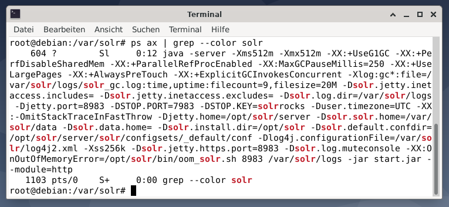
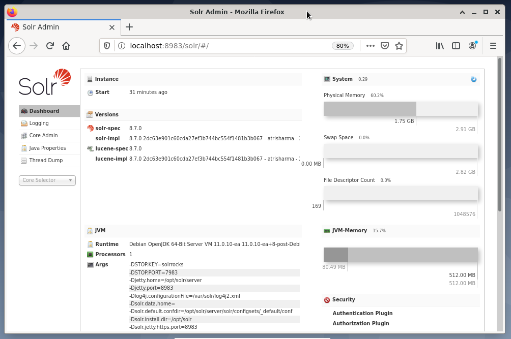

Einführung zu Apache Solr
=========================
Frank Hofmann
:subtitle: Solr Workshop 25.-29. Januar 2021
:doctype: article
:copyright: Frank Hofmann
:revnumber: 0.1
:Author Initials: FH
:edition: 1
:lang: de
:date: 1. Februar 2021
:numbered:
:source-highlighter: rouge

== Willkommen zur Schulung ==

* Vorstellungsrunde

* Ablauf des Workshops
  - zeitliche Verteilung
  - Pausen

* Klärung des Vorwissens
  - zu Linux/Kommandozeile allgemein
  - zu Solr im Besonderen

* Benutzung der VM mit Debian 11
** Software: XFCE4, Terminals, Webbrowser, Benutzerwechsel

== Einrichtung von Solr auf einem Debian GNU/Linux ==
=== Installation ===

==== Softwarebezug und auspacken ====

* derzeit nicht als Debian-Paket verfügbar, deshalb Bezug des tar.gz von der Projektwebseite
* in der VM bereits installiert unter `/opt/solr-8.7.0`
* symbolischer Link: `/opt/solr` -> `/opt/solr-8.7.0`

==== Solr-Verzeichnisse -- wo befindet sich was ====

* https://lucene.apache.org/solr/guide/8_7/installing-solr.html#directory-layout
* `bin`, `contrib`, `dist`, `docs`, `example`, `licenses`, `server`

* Beispiele
** https://lucene.apache.org/solr/guide/8_7/installing-solr.html#solr-examples
** `example`: `files` (Dateien), `films` (Videodateien), ...

==== Parameter zum Setup ====

* Services und Ports: `/opt/solr/server/etc`

=== Solr aktivieren ===

* Solr-Instanzen starten und beenden als Benutzer `root`

Status anzeigen:: `systemctl status` sowie `solr/bin status`

Solr starten :: `systemctl start solr` sowie `solr/bin start`

Solr auf besonderem Port starten :: `solr/bin start -p Portnummer`

[source,bash]
----
# solr/bin start -p 10000
----

Solr anhalten :: `systemctl stop solr` sowie `solr/bin stop`

Solr neustarten :: `systemctl restart solr` sowie `solr/bin restart`

=== Prüfen, ob Solr-Server läuft ===

----
# ps ax | grep --color solr
----

[[fig.solr-ps]]
.Solr läuft erfolgreich

=== Daten zu Solr über die Kommandozeile hinzufügen ===

* nicht als Benutzer `root`, sondern als Benutzer `solr`

* Benutzer `solr` hat nach der Installation kein Passwort
* als Benutzer `root` dem Benutzer `solr` ein Passwort geben

[source,bash]]
----
# passwd solr
----

== Bedienung und Administration ==

* Über die Weboberfläche 
** `http://localhost:8983/solr`
** Solr Dashboard:
*** Elemente, Anzeigen und Navigation
*** Details zu Anfragen und Lastverteilung

[[fig.solr-wui]]
.Solr über den Webbrowser administrieren

== Solr-Begriffe ==

* Solr-Architektur
  - Modi: Master-Slave vs Cluster (SolrCloud)

* Indexierung von Dokumenten bei Solr
  - Terminologie/Begriffe: Dokument, Feld, Collection, Shard, Node, Replica, Leaders, Cluster

* Wie funktioniert eine Suchmaschine
  - eingesetzte Verfahren (Gewichtung, Faktoren)
  - Indexierung von Dokumenten
  - Evaluierung der Anfrage
  - Erstellung des Suchergebnisses

* Was verwendet Solr
  https://bigwisdom.net/solr-tutorial-learn-solr-in-2-hours/

== Praxis: Beispieldaten benutzen ==

=== Benutzung über die Kommandozeile ===

* Durchführung als Benutzer `solr`
* Collection/Core anlegen
[source,bash]
----
$ solr/bin/solr create -c techproducts
----

* Daten hinzufügen (XML-Dateien aus `exampledocs`)
[source,bash]
----
$ solr/bin/post -c techproducts solr/example/exampledocs/*.xml
----

* Collection/Core entfernen
[source,bash]
----
$ solr/bin/solr delete -c techproducts
----

=== Praxisbeispiel: Core `cars` ===

==== Core hinzufügen ====

[source,bash]
----
$ bin/solr create -c cars
----

==== Felder für den zu indexierenden Datenbestand definieren ====

* Weboberfläche: Core->cars->Schema
* Datei: `/var/solr/data/cars/conf/managed-schema`

[source,xml]
----
<field name="id" type="string" indexed="true" stored="true" required="true" multiValued="false" />
<field name="make" type="string" indexed="true" stored="true" required="true" />
<field name="model" type="string" indexed="true" stored="true"/>
<field name="description" type="text_general" indexed="true" stored="true" />
<field name="colour" type="string" indexed="true" stored="true"/>
<field name="price" type="tint" indexed="true" stored="true"/>
----

==== Server neustarten ====

* Solr-Server neustarten, um diesen Core zu aktualisieren (als Benutzer `root`)

[source,bash]
----
# systemctl restart solr
----

* Logfiles überprüfen
* neue Felder in der Solr-Weboberfläche anzeigen
** Core->cars->Schema->Auswahlbox

==== Dokumente indexieren ====

* Vorbereiten der Dokumente zur Indexierung
** das Dokument muss die gleichen Feldnamen wie im Schema enthalten
** für dynamische Felder muss das Feldsuffix übereinstimmen
** die Feldwerte müssen zu den Feldtypen passen
** die Felder, die im Schema als “required” (erforderlich) deklariert sind, müssen auch im Datensatz vorhanden sein -- ansonsten wird das Dokument nicht indexiert

* Dateien zur Indexierung vorbereiten -- hier: `cars.xml`

[source,xml]
----
<add>
    <doc>
        <field name="id">1</field>
        <field name="make">BMW</field>
        <field name="model">X5</field>
        <field name="description">Brand new car</field>
        <field name="colour">Grey</field>
        <field name="price">45000</field>
    </doc>
    <doc>
        <field name="id">2</field>
        <field name="make">Audi</field>
        <field name="model">A4</field>
        <field name="description">Not afraid of the snow</field>
        <field name="colour">Grey</field>
        <field name="price">40000</field>
    </doc>
</add>
----

==== Datei hochladen ====

* mittels `curl` als Benutzer `solr`

[source,bash]
----
$ curl http://localhost:8983/solr/cars/update -H 'Content-type:text/xml' --data-binary 'Inhalt'
----

* mittels `post`

[source,bash]
----
$ bin/post -c cars cars.xml
----

* über die Weboberfläche:
** core->cars->Documents
** Document Type: File upload -> cars.xml auswählen
** Submit Document

==== Veränderungen im Datenbestand sehen ====

* über die Weboberfläche
** core->cars->Overview
** Eintrag: Num Docs

* im Datenbestand für den Core `cars` suchen
** core->cars->Query

== Solr an PostgreSQL anbinden ==

=== PostgreSQL einrichten ===

* Client- und Serverpaket installieren

[source,bash]
----
# apt-get install postgresql-13 postgresql-client-13
----

* Prüfen, ob PostgreSQL läuft:

[source,bash]
----
# pg_isready
----

* Passwort für UNIX-Benutzer `postgres` setzen

[source,bash]
----
# passwd postgres
----

* zum UNIX-Benutzer `postgres` wechseln und PostgreSQL-Benutzer `postgres` ein Passwort geben

[source,bash]
----
# su - postgres
$ psql -c "ALTER USER postgres WITH PASSWORD 'password';"
----

* an PostgreSQL als Benutzer `postgres` anmelden
[source,bash]
----
$ psql
----

* PostgreSQL-Benutzer `solr` mit Passwort erzeugen
[source,sql]
----
$ CREATE USER solr WITH PASSWD 'solr';
----

* Datenbank `cars` erzeugen (und von PostgreSQL abmelden)
[source,sql]
----
$ CREATE DATABASE cars;
\q
----

* als Benutzer `solr` an PostgreSQL anmelden
[source,bash]
----
$ psql -d cars -U solr
----

* Tabelle in der Datenbank `cars` erzeugen
[source,sql]
----
$ CREATE TABLE cars (
    id int, 
    make varchar(100), 
    model varchar(100),
    description varchar(100),
    colour varchar(50),
    price int
);
----

* Daten hinzufügen
[source,sql]
----
$ INSERT INTO cars (id, make, model, description, colour, price)
  VALUES (1, 'BMW', 'X5', 'Cool car', 'grey', 45000);
----

=== PostgreSQL-JDBC-Treiber installieren

* als Benutzer `root`

[source,bash]
----
# apt-get install libpostgresql-jdbc-java
----

=== Solr konfigurieren ===

* Links:
** http://blog.comperiosearch.com/blog/2014/08/28/indexing-database-using-solr/
** http://blog.comperiosearch.com/blog/2015/04/14/solr-indexing-index-sql-databases-made-easier-part-2/
** https://www.searchstax.com/blog/importing-data-postgresql-solr/

* Datei `/var/solr/data/cars/conf/solrconfig.xml` um diese Zeilen ergänzen:

[source,xml]
----
<lib path="/usr/share/java/postgresql.jar" />
<lib path="/opt/solr/dist/solr-dataimporthandler-8.7.0.jar" />
<requestHandler name="/dataimport" class="org.apache.solr.handler.dataimport.DataImportHandler">
    <lst name="defaults">
        <str name="config">db-data-config.xml</str>
    </lst>
</requestHandler>
----

* erzeuge Datei `/var/solr/data/cars/conf/data-config.xml` und befülle mit:

[source,xml]
----
<dataConfig>
    <dataSource type=”JdbcDataSource” 
                driver=”org.postgresql.Driver” 
                url=”jdbc:postgresql://localhost:5432/cars” 
                user=”solr” 
                password=”solr” />
    <document>
        <entity name="id" query="select * from cars;" />
    </document>
</dataConfig>
----

* Solr-Server neu starten

[source,bash]
----
# systemctl restart solr
----

* Daten über die Solr-Weboberfläche importieren
** cars->Dataimport->full-import->Execute

== Anfragen an Solr senden ==

* Quellen: 
** http://yonik.com/solr-tutorial/
** http://yonik.com/solr/query-syntax/

* Parameter zur Anfrage:
** https://www.tutorialspoint.com/apache_solr/apache_solr_querying_data.htm
** Anfrage (Query), Sortierung, von-bis, Ausgabeformat, ...

=== Anfragen mit Curl === 

* Ausgabe ist JSON-Datensatz
* alle Datensätze vollständig ausgeben

[source,bash]
----
$ curl http://localhost:8983/solr/cars/query?q=id:*
----

* nur den vollständigen Datensatz mit der Id 2 erhalten

[source,bash]
----
$ curl http://localhost:8983/solr/cars/query?q=id:2
----

* alle Datensätze mit dem Feld `model` ausgeben

[source,bash]
----
$ curl 'http://localhost:8983/solr/cars/query?q=id:*&fl=model'
$ curl http://localhost:8983/solr/cars/query?q=id:*\&fl=model
----

* alle Datensätze mit den beiden Feldern `make` und `model` ausgeben

[source,bash]
----
$ curl 'http://localhost:8983/solr/cars/query?q=id:*&fl=make,model'
$ curl http://localhost:8983/solr/cars/query?q=id:*\&fl=make,model
----

* alle Datensätze mit den Feldern `make`, `model` und `price` absteigend nach Preis ausgeben

[source,bash]
----
$ curl http://localhost:8983/solr/cars/query -d '
  q=*:*&
  sort=price desc&
  fl=make,model,price '
----

* nur die ersten 5 Datensätze mit den Feldern `make`, `model` und `price` absteigend nach Preis ausgeben

[source,bash]
----
$ curl http://localhost:8983/solr/cars/query -d '
  q=*:*&
  rows=5&
  sort=price desc&
  fl=make,model,price '
----

=== Facets und eingebaute Funktionen verwenden ===

* Quelle
** http://yonik.com/solr-facet-functions/

* Funktionen (Auswahl):
** `sum()`, `avg()`, `min()`, `max()`, `variance()`, `stddev()`

* den Durchschnittspreis für alle Datensätze berechnen

[source,bash]
----
$ curl http://localhost:8983/solr/cars/query -d "
  q=*:*&
  json.facet={x:'avg(price)'}"
----

* Durchschnittspreis für die Datensätze zu BMWs berechnen

[source,bash]
----
$ curl http://localhost:8983/solr/cars/query -d "
  q=make:BMW&
  json.facet={avgprice:'avg(price)'}"
----

* Durchschnittspreis und Gesamtsumme für die Datensätze zu BMWs berechnen

[source,bash]
----
$ curl http://localhost:8983/solr/cars/query -d "
  q=make:BMW&
  json.facet={avgprice:'avg(price)'}&"
  json.facet={totalsum:'sum(price)'}"
----

=== SQL-Kommandos an Solr senden ===

* Beispiel mit `curl`

[source,bash]
----
$ curl --data-urlencode 'stmt=select * from cars' http://localhost:8983/solr/cars/sql
----

* diese Form der Anfrage geht nur, wenn Solr als Cluster konfiguriert ist (mehr als 1 Knoten)

* Quellen
** https://sematext.com/blog/solr-6-solrcloud-sql-support/
** Parallel SQL Interface -- https://lucene.apache.org/solr/guide/8_7/parallel-sql-interface.html

* andere Interfaces, bspw. SQL/JDBC-Connectors
** SQuirreL SQL -- http://squirrel-sql.sourceforge.net/
** Apache Zeppelin -- http://zeppelin.apache.org/

=== Anbindung an Solr über APIs ===

PHP :: Solarium -- http://www.solarium-project.org/

Python :: pysolr -- https://pypi.org/project/pysolr/

Go :: go-solr -- https://github.com/vanng822/go-solr

Tcl :: solr4tcl -- https://github.com/ray2501/solr4tcl

Perl :: Solr -- https://metacpan.org/pod/Solr

== Aus einem Core eine Collection machen ==

=== Begriffe ===

* Core und Collection
** Core: ein Knoten
** Collection: mehrere Cores (Knoten)

=== Solr mit mehreren Cores als Collection betreiben ===

==== Einrichtung über mitgeliefertes Skript ====

[source,bash]
----
$ bin/solr -e cloud
----

==== von Hand anlegen ====

* Collection anlegen

[source,bash]
----
$ bin/solr create_collection -c cars 
----

* Knoten 1 anlegen und starten

[source,bash]
----
$ bin/solr start -cloud -s example/cloud/node1/solr -p 8983
----

* Knoten 2 anlegen und starten

[source,bash]
----
$ bin/solr start -cloud -s example/cloud/node2/solr -p 7574
----
